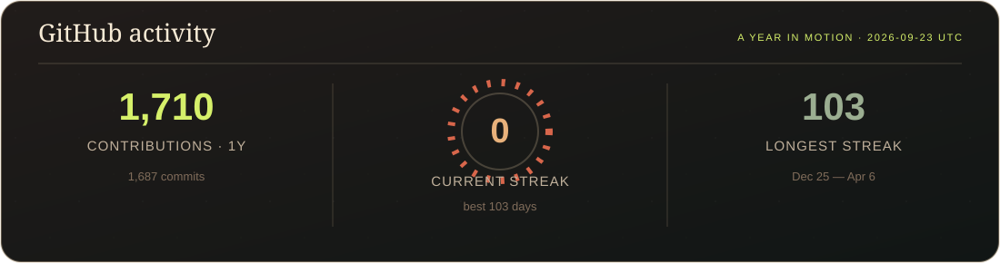

  

  

<h2 align="center">✦ WHO I AM ✦</h2>

  <b>B.Tech Information Technology @ MIT-ADT University, Pune</b> 
  <b>Minor in Quantum Computing</b>

  I enjoy building software end to end and understanding how the pieces
  of a system work together — from interfaces and APIs to databases,
  AI services, deployment and automation.

  My work spans <b>Full-Stack Development</b>, <b>AI/ML</b>,
  <b>Computer Vision</b>, <b>Cloud</b>, <b>DevOps</b>,
  <b>Mobile Development</b> and <b>Emerging Technologies</b>.

<h2 align="center">🌈 TECHNOLOGY RAINBOW</h2>

  

  
  
  
  
  

  
  
  
  

<h2 align="center">🧩 ENGINEERING MAP</h2>

<table align="center" width="100%">
  <tr>
    <td align="center" width="25%" valign="top">
      <h3>🎨 Frontend</h3>
      
React JavaScript TypeScript HTML5 CSS3

    </td>
    <td align="center" width="25%" valign="top">
      <h3>⚙️ Backend</h3>
      
Java Spring Boot Node.js Express FastAPI

    </td>
    <td align="center" width="25%" valign="top">
      <h3>🧠 AI / ML</h3>
      
Machine Learning Computer Vision YOLOv8 RAG FAISS

    </td>
    <td align="center" width="25%" valign="top">
      <h3>☁️ Cloud / DevOps</h3>
      
AWS Docker Jenkins CI/CD Git

    </td>
  </tr>
  <tr>
    <td align="center" valign="top">
      <h3>🗄️ Data</h3>
      
MySQL PostgreSQL MongoDB Firebase

    </td>
    <td align="center" valign="top">
      <h3>📱 Mobile</h3>
      
Android Kotlin Swift UIKit

    </td>
    <td align="center" valign="top">
      <h3>🔗 Emerging</h3>
      
Blockchain Ethereum Solidity Web3.py

    </td>
    <td align="center" valign="top">
      <h3>🔬 Quantum</h3>
      
Quantum Computing Quantum Algorithms QML

    </td>
  </tr>
</table>

<h2 align="center">🚀 FEATURED WORK</h2>

  <i>A few systems I've built and worked on.</i>

<table width="100%">
  <tr>
    <td width="50%" valign="top">
      <h3>🛡️ Intelligent Mob Surveillance System</h3>
      
AI-powered CCTV platform for real-time crowd and mob detection, secure evidence handling and blockchain-backed integrity verification.

<b>Stack</b>

  

    <code>YOLOv8</code> · <code>OpenCV</code> · <code>FastAPI</code> 
    <code>MongoDB</code> · <code>Docker</code> · <code>Jenkins</code> 
    <code>Solidity</code> · <code>Ethereum</code> · <code>Web3.py</code>
  

<b>Built around</b>

  

    • Real-time computer vision 
    • AES-256 evidence encryption 
    • SHA-256 integrity hashing 
    • Smart-contract verification 
    • Dockerized services 
    • Jenkins CI/CD 
    • Docker Compose deployment
  

  
</td>

<td width="50%" valign="top">
  <h3>🧬 QuantumMind AI</h3>
  
Multimodal AI platform for quantum research combining RAG, semantic search, conversational AI and visual analysis.

<b>Stack</b>

  

    <code>React</code> · <code>Spring Boot</code> · <code>FastAPI</code> 
    <code>PostgreSQL</code> · <code>FAISS</code> · <code>Docker</code>
  

<b>Built around</b>

  

    • Retrieval-Augmented Generation 
    • Semantic vector search 
    • Real-time AI streaming 
    • JWT authentication 
    • Role-based access 
    • Vision AI 
    • Multi-service architecture
  

  
</td>

  </tr>

  <tr>
    <td width="50%" valign="top">
      <h3>🎯 SkillMatch</h3>
      
Full-stack learning recommendation platform that connects existing skills with target roles and learning paths.

<b>Stack</b>

  
<code>Node.js</code> · <code>Express.js</code> · <code>MySQL</code> · <code>EJS</code>

<b>Built around</b>

  

    • MVC architecture 
    • Authentication 
    • RBAC 
    • Recommendation logic 
    • REST APIs 
    • CRUD operations
  

  
</td>

<td width="50%" valign="top">
  <h3>🧠 BrainMatch</h3>
  
Native iOS memory-matching game developed with Swift and UIKit.

<b>Stack</b>

  
<code>Swift</code> · <code>UIKit</code>

<b>Built around</b>

  

    • Native iOS development 
    • Interactive gameplay 
    • Card animations 
    • Game-state handling 
    • UserDefaults persistence
  

  
</td>

  </tr>
</table>

<h2 align="center">🏆 HIGHLIGHTS</h2>

  
  

  
  
  

<h2 align="center">🔭 CURRENTLY EXPLORING</h2>

  

<h2 align="center">📊 GITHUB ACTIVITY</h2>

  

<h2 align="center">🐍 CONTRIBUTION JOURNEY</h2>

  <i>Building consistently, one commit at a time.</i>

  

  

---

<h2 align="center">🌐 LET'S CONNECT</h2>

  
  
  
  

  <b>Build · Break · Understand · Improve</b>

  

