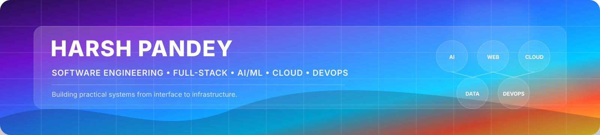

<!--
╔══════════════════════════════════════════════════════════════╗
║                    HARSH PANDEY                              ║
║          Animated GitHub Profile / Portfolio README         ║
╚══════════════════════════════════════════════════════════════╝
-->

  

  
  
  
  

 

  

 

---

## ✦ WHO I AM

  
  
  

  I enjoy building software end to end and understanding how the pieces
  of a system work together — from interfaces and APIs to databases,
  AI services, deployment and automation.

  My work spans <b>Full-Stack Development</b>, <b>AI/ML</b>,
  <b>Computer Vision</b>, <b>Cloud</b>, <b>DevOps</b>,
  <b>Mobile Development</b> and <b>Emerging Technologies</b>.

 

---

# ◈ THE ENGINEERING MAP

<table align="center" width="100%">
<tr>

<td align="center" width="25%" valign="top">

### ◉ FRONTEND

React  
JavaScript  
TypeScript  
HTML5  
CSS3

</td>

<td align="center" width="25%" valign="top">

### ◉ BACKEND

Java  
Spring Boot  
Node.js  
Express  
FastAPI

</td>

<td align="center" width="25%" valign="top">

### ◉ AI / ML

Machine Learning  
Computer Vision  
YOLOv8  
RAG  
FAISS

</td>

<td align="center" width="25%" valign="top">

### ◉ CLOUD

AWS  
Docker  
Jenkins  
CI/CD  
Git

</td>

</tr>

<tr>

<td align="center" valign="top">

### ◉ DATA

MySQL  
PostgreSQL  
MongoDB  
Firebase

</td>

<td align="center" valign="top">

### ◉ MOBILE

Android  
Kotlin  
Swift  
UIKit

</td>

<td align="center" valign="top">

### ◉ WEB3

Blockchain  
Ethereum  
Solidity  
Web3.py

</td>

<td align="center" valign="top">

### ◉ QUANTUM

Quantum Computing  
Quantum Algorithms  
QML

</td>

</tr>
</table>

 

  

 

---

# ◈ SELECTED WORK

  <i>A few systems I've built and worked on.</i>

 

<table width="100%">
<tr>

<td width="50%" valign="top">

## 🛡️ Intelligent Mob Surveillance System

AI-powered CCTV platform for real-time crowd and mob detection, secure evidence handling and blockchain-backed integrity verification.

**Built around**

- Real-time computer vision
- AES-256 evidence encryption
- SHA-256 integrity hashing
- Smart-contract verification
- Dockerized services
- Jenkins CI/CD
- Docker Compose deployment

**Stack**

`YOLOv8` `OpenCV` `FastAPI`  
`MongoDB` `Docker` `Jenkins`  
`Solidity` `Ethereum` `Web3.py`

 

</td>

<td width="50%" valign="top">

## 🧬 QuantumMind AI

Multimodal AI platform for quantum research combining RAG, semantic search, conversational AI and visual analysis.

**Built around**

- Retrieval-Augmented Generation
- Semantic vector search
- Real-time AI streaming
- JWT authentication
- Role-based access
- Vision AI
- Multi-service architecture

**Stack**

`React` `Spring Boot` `FastAPI`  
`PostgreSQL` `FAISS` `Docker`

 

</td>

</tr>

<tr>

<td width="50%" valign="top">

## 🎯 SkillMatch

Full-stack learning recommendation platform that connects existing skills with target roles and learning paths.

**Built around**

- MVC architecture
- Authentication
- RBAC
- Recommendation logic
- REST APIs
- CRUD operations

**Stack**

`Node.js` `Express.js` `MySQL` `EJS`

 

</td>

<td width="50%" valign="top">

## 🧠 BrainMatch

Native iOS memory-matching game developed with Swift and UIKit.

**Built around**

- Native iOS development
- Interactive gameplay
- Card animations
- Game-state handling
- UserDefaults persistence

**Stack**

`Swift` `UIKit`

 

</td>

</tr>
</table>

 

---

# ◈ HIGHLIGHTS

 

---

# ◈ CURRENTLY EXPLORING

 

---

# ◈ GITHUB ACTIVITY

  

 

---

# ◈ CONTRIBUTION JOURNEY

  <i>Building consistently, one commit at a time.</i>

  

  

 

---

# ◈ LET'S CONNECT

 

  

  <b>Build · Break · Understand · Improve</b>

