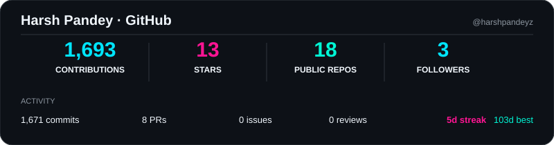
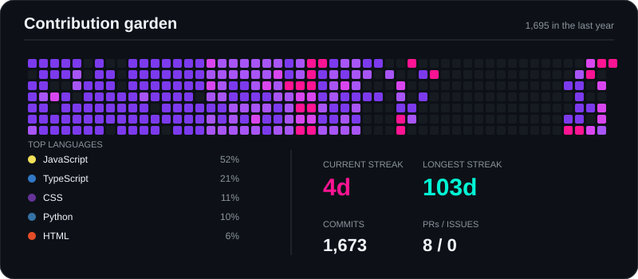

<div align="center">

# ` harsh pandey `


<br>

[](https://github.com/harshpandeyz)
[](https://www.linkedin.com/in/harshpandeyz/)
[](https://harshporfolio.netlify.app/)

</div>


# 🧩 `what's in the box?`

<table>
<tr>

<td align="center" width="25%">

### 🎨 BUILD

**Frontend**

React
JavaScript
TypeScript
HTML
CSS

</td>

<td align="center" width="25%">

### ⚙️ CREATE

**Backend**

Java
Spring Boot
Node.js
FastAPI
REST APIs

</td>

<td align="center" width="25%">

### 🧠 EXPERIMENT

**AI / Data**

ML
Computer Vision
YOLOv8
RAG
FAISS

</td>

<td align="center" width="25%">

### ☁️ SHIP

**Infrastructure**

AWS
Docker
Jenkins
Git
CI/CD

</td>

</tr>
</table>

<div align="center">


</div>

---

# 🚀 `things i've built`

> A few things that escaped the localhost.

<br>

<table width="100%">

<tr>

<td width="50%" valign="top">

## 🛡️ Intelligent Mob Surveillance

### `AI × VISION × BLOCKCHAIN`

A real-time CCTV system for crowd/mob detection with secure evidence handling and blockchain-backed integrity verification.

**Built with**

`YOLOv8` `OpenCV`
`FastAPI` `MongoDB`
`Docker` `Jenkins`
`Solidity` `Ethereum`

**Interesting bits**

🔹 Real-time computer vision
🔹 AES-256 evidence encryption
🔹 SHA-256 integrity hashing
🔹 Smart-contract verification
🔹 Containerized services
🔹 CI/CD deployment

<br>

<a href="https://github.com/harshpandeyz/intelligent-surveillance-system-v2">

</a>

</td>

<td width="50%" valign="top">

## 🎼 OrchestraAI

### `AI × ORCHESTRATION × SYSTEMS`

An intelligent control plane for AI agents that dynamically orchestrates models, context, memory, tools, and runtime resources to optimize quality, cost, latency, and reliability.

**Built with**

`Node.js` `React`
`JavaScript` `TypeScript`
`Docker` `PostgreSQL`
`AI Agents`

**Interesting bits**

🔹 Intelligent model routing
🔹 Context and memory management
🔹 Semantic caching
🔹 Execution intelligence
🔹 Cost-aware orchestration
🔹 Secure isolated execution
🔹 Runtime telemetry
🔹 Multi-agent infrastructure

<br>

<a href="https://github.com/harshpandeyz/OrchestraAI">

</a>

</td>

</tr>

<tr>

<td width="50%" valign="top">

## 🎯 SkillMatch

### `SKILLS → ROLES → LEARNING`

A full-stack learning recommendation platform connecting skills with target roles and learning paths.

**Stack**

`Node.js` `Express.js`
`MySQL` `EJS`

**Under the hood**

🟢 MVC architecture
🟢 Authentication
🟢 RBAC
🟢 REST APIs
🟢 Recommendation logic

<br>

<a href="https://github.com/harshpandeyz/SkillMatch">

</a>

</td>

<td width="50%" valign="top">

## 🧠 BrainMatch

### `SWIFT × UIKIT × FUN`

A native iOS memory-matching game built around interactive gameplay and animations.

**Stack**

`Swift` `UIKit`

**Inside**

🟠 Card animations
🟠 Game-state handling
🟠 Interactive gameplay
🟠 UserDefaults persistence

<br>

<a href="https://github.com/harshpandeyz/brainmatch-game">

</a>

</td>

</tr>

</table>

---

<div align="center">

### 🔭 More experiments live here

<a href="https://github.com/harshpandeyz?tab=repositories">


</a>

</div>

---

# 🌈 `my developer palette`

<table width="100%">
<tr>

<td align="center">

### 🟣 AI

Machine Learning
Computer Vision
RAG
Vector Search
FAISS

</td>

<td align="center">

### 🔵 WEB

React
Node.js
Java
Spring Boot
FastAPI

</td>

<td align="center">

### 🟢 CLOUD

AWS
Docker
Jenkins
CI/CD
Git

</td>

<td align="center">

### 🟠 EXPERIMENTS

Blockchain
Ethereum
Android
iOS
Quantum

</td>

</tr>
</table>

---
---

# 📊 `github statistics`

<div align="center">



</div>

---

# 🟣 `contribution garden`

<div align="center">



</div>

---

---
# 🧪 `currently experimenting with`

<div align="center">

|     🧠 AI     | ☁️ Cloud |  🏗️ Systems  | 🔬 Frontier |
| :-----------: | :------: | :-----------: | :---------: |
|      RAG      |    AWS   | System Design |   Quantum   |
| Vector Search |  Docker  |      APIs     |  Blockchain |
|   Vision AI   |   CI/CD  |  Scalability  |     QML     |

</div>

---

# 🏆 `little wins`

<div align="center">


<br><br>


</div>

---

# 💭 `random developer thoughts`

```text
"Why does this work?"
        ↓
"Interesting."
        ↓
"Let's change it."
        ↓
"Why did everything break?"
        ↓
"Okay... now I understand it."
        ↓
git commit -m "fixed"
