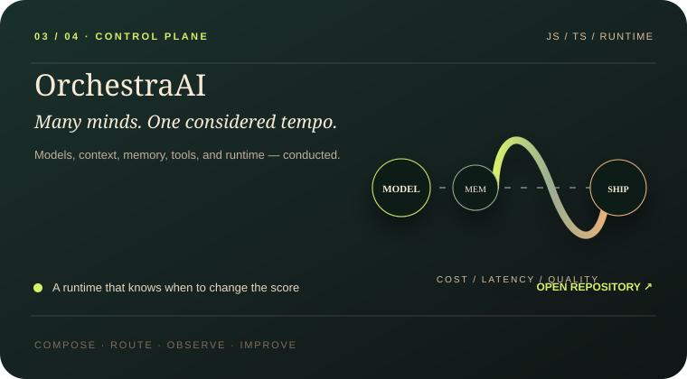

<a href="#skills">Skills</a> ·
<a href="#work">Work</a> ·
<a href="#graphs">Graphs</a> ·
<a href="https://github.com/harshpandeyz">GitHub ↗</a>

**Harsh Pandey** — B.Tech IT @ MIT ADT Pune. I build software that senses, reasons, and ships.

<a href="https://github.com/harshpandeyz">GitHub ↗</a> ·
<a href="https://www.linkedin.com/in/harshpandeyz/">LinkedIn ↗</a> ·
<a href="https://harshporfolio.netlify.app/">Portfolio ↗</a>

## Skills

<b>Text index — the same map in words</b>

 

**Languages:** Python (Advanced) · JavaScript (Advanced) · TypeScript (Proficient) · Java / Kotlin / Swift (Shipped) · C++ · SQL 
**Frontend:** React + Vite · HTML/CSS · Tailwind 
**Backend:** Node + Express · FastAPI + REST · Spring Boot · MVC / Auth / RBAC 
**AI / Vision:** YOLOv8 + OpenCV · RAG + FAISS + vector search · Agents + orchestration 
**Databases:** MySQL + PostgreSQL · MongoDB + Firebase 
**Cloud / Delivery:** Docker + CI/CD · AWS + Jenkins · system design 
**Tooling:** Git + GitHub + VS Code · Linux + Shell + Postman · Solidity basics

## Work

<table width="100%">
<tr>
<td width="50%" valign="top" align="center">

 

 YOLOv8 · FastAPI · Docker — vision → decision → evidence
</td>
<td width="50%" valign="top" align="center">

 

 RAG · FAISS · Multimodal — retrieve → connect → explain
</td>
</tr>
<tr>
<td width="50%" valign="top" align="center">

 

 Agents · Routing · Runtime — compose → route → observe
</td>
<td width="50%" valign="top" align="center">

 

 React · Vite · TS — publish → invite → keep looking
</td>
</tr>
</table>

## Graphs

  

  

  

  

  
<!-- Snake publishes to the `output` branch via .github/workflows/snake.yml. If empty, run that workflow once. -->

All graphs live: custom plates regenerate daily from the GitHub GraphQL API · plates' stars update on every view.

---

**Harsh Pandey** · build with care, learn in public · [GitHub](https://github.com/harshpandeyz) · [LinkedIn](https://www.linkedin.com/in/harshpandeyz/) · [Portfolio](https://harshporfolio.netlify.app/)

