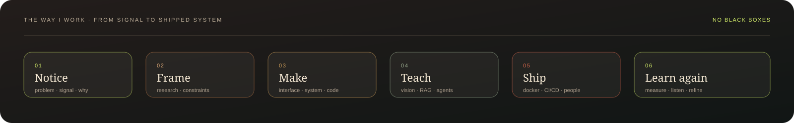
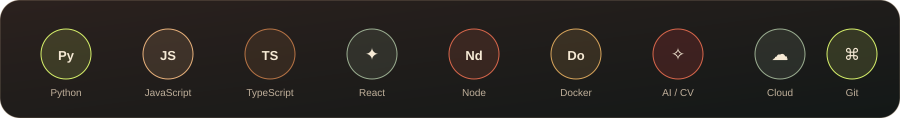

<a href="#identity">Identity</a> ·
<a href="#featured-work">Work</a> ·
<a href="#the-method">Method</a> ·
<a href="#github-intelligence">Intelligence</a> ·
<a href="#the-workshop-map">Skills</a> ·
<a href="#a-likeness">Portrait</a> ·
<a href="https://github.com/harshpandeyz">GitHub ↗</a>

FULL-STACK ENGINEERING · APPLIED AI · SYSTEMS THAT HOLD UP UNDER PRESSURE

---

## Identity

**Harsh Pandey** is a B.Tech IT student at MIT ADT University, Pune, building at the seam between useful software and strange new ideas.

I like the moment a vague problem becomes a system with a pulse: a camera that notices, a research tool that connects the dots, an orchestration layer that knows when to change course, a portfolio that makes the work legible.

Currently exploring RAG, vector search, vision AI, agents, Docker, CI/CD, and system design. The public work below is sourced from real repositories, real language data, and a live GitHub workflow.

<a href="https://github.com/harshpandeyz">GitHub ↗</a> ·
<a href="https://www.linkedin.com/in/harshpandeyz/">LinkedIn ↗</a> ·
<a href="https://harshporfolio.netlify.app/">Portfolio ↗</a>

## Featured work

Four builds, four distinct instruments. Each plate opens the repository.

<table width="100%">
<tr>
<td width="50%" valign="top" align="center">

Python · JavaScript · Solidity · HTML/CSS
</td>
<td width="50%" valign="top" align="center">

JavaScript · Python · Java · HTML/CSS
</td>
</tr>
<tr><td colspan="2"> </td></tr>
<tr>
<td width="50%" valign="top" align="center">

JavaScript · TypeScript · HTML/CSS
</td>
<td width="50%" valign="top" align="center">

TypeScript · JavaScript · React · Vite
</td>
</tr>
</table>

<table width="100%">
<tr><th align="left">Build</th><th align="left">Signal</th><th align="left">Why it matters</th></tr>
<tr><td><a href="https://github.com/harshpandeyz/Intelligent-Mob-Surveillance-System">Intelligent Mob Surveillance System</a></td><td>vision → decision → evidence</td><td>real-time activity monitoring with Solidity evidence handling</td></tr>
<tr><td><a href="https://github.com/harshpandeyz/QuantumMind">QuantumMind</a></td><td>retrieve → connect → explain</td><td>multimodal research intelligence for difficult questions</td></tr>
<tr><td><a href="https://github.com/harshpandeyz/OrchestraAI">OrchestraAI</a></td><td>compose → route → observe</td><td>cost, latency, and quality-aware AI agent orchestration</td></tr>
<tr><td><a href="https://github.com/harshpandeyz/new-portfolio">new-portfolio</a></td><td>publish → invite → keep looking</td><td>a considered public home for the wider practice</td></tr>
</table>

## The method

I care about the full arc: the first question, the shape of the interface, the hard edges of an API, the behavior of the model, and what happens after a human starts using it.

## GitHub intelligence

  

  

  

Source: GitHub GraphQL <code>contributionsCollection</code>, <code>repositories.languages</code>, and <code>updatedAt</code>. The assets are regenerated by <code>.github/workflows/update-github-stats.yml</code> through <code>.github/scripts/generate-github-stats.js</code>; charts remain honest, dated, and hoverable.

## The workshop map

<b>Text index — the same map in words</b>

 

**Languages:** Python (Advanced) · JavaScript (Advanced) · TypeScript (Proficient) · Java / Kotlin / Swift (Shipped) · C++ foundations · SQL dialects 
**Frontend:** React + Vite (Proficient) · HTML/CSS (Advanced) · Tailwind + UI systems (Proficient) 
**Backend:** Node.js + Express (Proficient) · FastAPI + REST (Proficient) · Spring Boot (Intermediate) · MVC / Auth / RBAC 
**AI / Vision:** YOLOv8 + OpenCV (Applied) · RAG + FAISS + vector search (Applied) · Agents + orchestration (Applied) 
**Databases:** MySQL + PostgreSQL (Proficient) · MongoDB + Firebase (Proficient) · modeling, indexing, semantic cache 
**Cloud / Delivery:** Docker + CI/CD (Proficient) · AWS + Jenkins (Working) · system design (Learning) 
**Tooling:** Git + GitHub + VS Code (Advanced) · Linux + Shell + Postman (Proficient) · Solidity basics

## A likeness

 

A portrait, not a mascot. The illustration is a gouache-and-ink interpretation with a paper-grain finish; its orbit and greeting have a quiet hover state, designed to remain lightweight inside GitHub's renderer.

## Small proofs, larger direction

| Best Idea · IdeaSpark 2K24 | BV TechFusion · National Level | AMCAT Computer Science · 99/100 |
| :---: | :---: | :---: |
| RAG · Vision AI · Agents | AWS · Docker · CI/CD | System design · Quantum · Blockchain |

> *“Consistent learning today, a better tomorrow.”*

---

**Harsh Pandey** · build with care, learn in public, keep the signal clear.

[GitHub ↗](https://github.com/harshpandeyz) · [LinkedIn ↗](https://www.linkedin.com/in/harshpandeyz/) · [Portfolio ↗](https://harshporfolio.netlify.app/)

Made from ink, copper, celadon, and a reasonable amount of curiosity.

